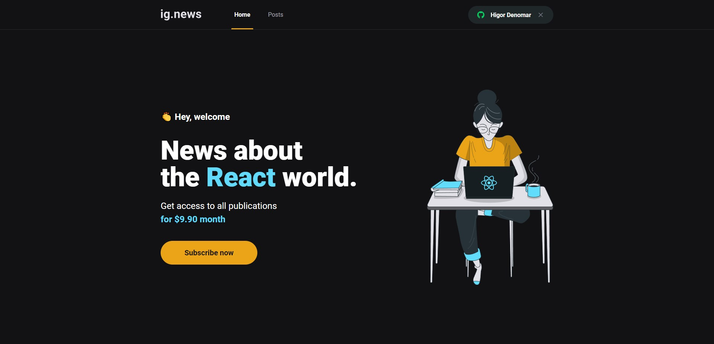

<p align="center">
  
</p>

<p align="center">
  
  
  
</p>

<p align="center">
  Blog com assinatura mensal, desenvolvido durante o terceiro módulo do treinamento de ReactJS do Ignite.

  
</p>

## Tecnologias

- [NextJS](https://nextjs.org/)
- [Typescript](https://www.typescriptlang.org/)
- [Sass](https://sass-lang.com/)
- [Prismic CMS](https://prismic.io/)
- [FaunaDB](https://fauna.com/)
- [Stripe](https://stripe.com/br)

---
<br />

## Como usar

### Clone o projeto:

```sh

git clone https://github.com/HigorDenomar/ignews.git

```

### Rode o projeto (npm)

```sh
# Entre na pasta do projeto
cd ignews

# Instale as dependências
npm install

# Rode o projeto
npm run dev

```

#### Ou, se preferir o yarn:

```sh
# Entre na pasta do projeto
cd ignews

# Instale as dependências
yarn

# Rode o projeto
yarn dev

```

O projeto poderá ser acessado no seu [localhost:3000](http://localhost:3000)

---
<br />

<p>Com ❤️ <a src="https://github.com/HigorDenomar" alt="Higor Denomar">Higor Denomar</a> </p>

<a href="https://www.linkedin.com/in/higordenomar/">
  
</a>
<a href="mailto:contato.higordenomar@hotmail.com">
  
</a>